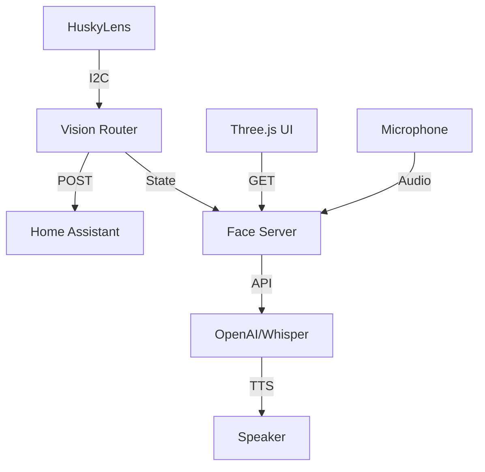

# TARS Vision — System Architecture

## Threading Model
The TARS system runs three main concurrent processes:

1. **Dashboard Manager (Flask, 5117)**:
   - Primary user interface for skill monitoring.
   - Serves the Three.js frontend.
   - Orchestrates overall skill discovery.

2. **Face Server (Flask, 5001)**:
   - **Heartbeat Thread**: Periodically queries the vision state.
   - **Voice Handler**: Processes incoming audio via Whisper and triggers TTS.
   - **Simulatio Layer**: For development, provides mock I2C data when library is missing.

3. **Vision Router (Standalone Loop)**:
   - Polls HuskyLens via I2C at ~10Hz.
   - Maps raw hand coordinates to "Palm", "Fist", or "Victory".
   - Dispatches REST calls to Home Assistant for physical automation.

## Data Flow

## Personality Integration
The system prompt (SOUL.md) is injected into the LLM context. TARS responses are parsed for emotion tags `[happy]`, `[curious]`, etc., which are then passed to the Three.js model for animation morphing.
